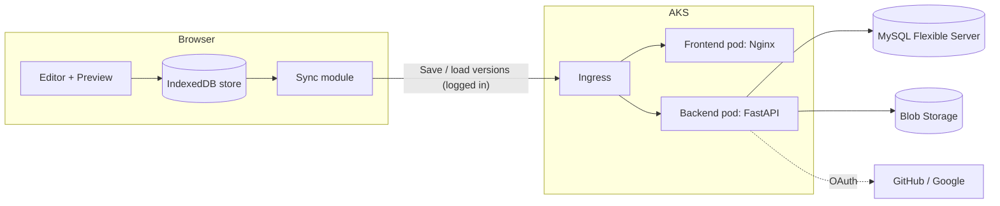

# PRD v3 — Technical Markdown Workspace

Sep 26, 2026 ·

## 1. Product overview

A web-based technical writing workspace: Markdown editor, live preview, and a project/folder hierarchy, all running in the browser. It works without an account. Signing in adds cloud version history that follows the user across devices.

**Working name:** to be decided.

**Content types:** Markdown, source code, Mermaid diagrams, LaTeX math, images, tables, links.

**Inspiration:** StackEdit for the local-first model and editor feel; Git for the working-copy-plus-committed-versions model. Deliberately smaller than either.

**Value proposition:** Write technical documents instantly with no signup. Your work stays on your device; sign in only if you want versions saved to the cloud.

## 2. Goals and non-goals

### Product goals

1. Comfortable Markdown editing with a live, browser-rendered preview.
2. Technical content: highlighted code, Mermaid, KaTeX math.
3. Project → folder → document hierarchy with image assets.
4. Image sizing and alignment (left/center/right, center default, always block).
5. Global rendering settings: font family, letter spacing, line spacing, margin, padding.
6. Styled code blocks: border, rounded corners, language label, copy button.
7. Works fully offline and without an account; data stored in the browser.
8. Optional login that enables cloud version history across devices.
9. Export (Markdown, HTML, PDF) and project import/export as .zip.

### Engineering goals

1. Simple, modular design with clear boundaries between editor, storage, and sync.
2. Every component runs in its own container, locally and in the cloud.
3. Kubernetes (AKS) deployment using hand-written YAML.
4. One-command infrastructure with Terraform.
5. Automated build and deploy with GitHub Actions.

### Non-goals

- Cloud storage of live working documents (only explicitly saved versions go to the server)
- Real-time collaboration, WebSockets, CRDTs
- Branching or merging of versions (history is linear)
- Server-side rendering of Markdown, diagrams, or math
- Building our own username/password system
- AI features, Git or third-party cloud-drive integrations

## 3. Users and use cases

**Primary user:** a developer, student, or researcher writing documents that mix prose, code, diagrams, and math, who wants to start instantly without signing up.

| User                 | What they do                                                       | Needs login? |
| -------------------- | ------------------------------------------------------------------ | ------------ |
| Anonymous writer     | Opens the app, writes notes, exports to HTML/PDF                   | No           |
| Returning local user | Continues work on the same browser days later                      | No           |
| Signed-in user       | Saves versions, restores old ones, opens history on another device | Yes          |

**Example projects:** "Operating Systems Notes" (`Processes.md`, `Threads.md`, `Scheduling.md` in folders); "My Application" (`README.md`, `Architecture.md` with Mermaid, an `images/` folder); algorithm notes with block math such as T(n) = 2T(n/2) + O(n).

## 4. Architecture overview

The app has two independent halves: a local workspace that runs entirely in the browser, and a cloud version service used only by signed-in users. The browser is the working copy; the server holds committed versions, like a Git remote.



**Principles**

- The editor and renderer never call the server. Only the sync and auth modules do.
- Typing never waits on the network; everything is saved locally first.
- Nothing leaves the device unless the user signs in and explicitly saves a version.
- The server stores source Markdown only, never rendered HTML.
- Each deployable piece (frontend, backend) is its own container; the same images run locally and on AKS.

## 5. Functional requirements: local workspace

Everything in this section works without login and without a network connection.

### 5.1 Project and file hierarchy

- Create, rename, delete, open projects; edit project description
- Create, rename, delete, nest folders
- Create, rename, delete, open, duplicate documents
- Move documents and folders (drag-and-drop or menu)
- Tree panel showing the full hierarchy, with empty states
- Confirmation on delete; deleting a folder or project cascades

### 5.2 Images

- Add images by drag-drop or file picker; stored in IndexedDB as project assets (max 5 MB each)
- Reference by relative path or external URL; "Insert image" writes the Markdown at the cursor
- Syntax: `{width=400 align=left}`
- Always a block element; `align` = left, center (default), right, implemented with `margin-inline`, never `float`
- `width` = bare number (px) or explicit `px` / `%`; aspect ratio preserved
- Missing image shows a visible placeholder; other Markdown tools ignore the `{…}` block

### 5.3 Editor

- CodeMirror 6 with Markdown syntax highlighting
- GFM: headings, lists, checklists, links, images, tables, blockquotes, code
- Undo/redo; Ctrl/Cmd+S saves locally immediately
- Modes: split, editor-only, preview-only
- Later: find and replace, formatting toolbar, scroll sync

### 5.4 Preview and rendering

- Client-side, debounced on edit, sanitized with DOMPurify
- Syntax highlighting for Java, JavaScript, TypeScript, Python, SQL, JSON, HTML, CSS, Bash
- Mermaid (flowchart, sequence, class, ER); KaTeX inline `$…$` and block `$$…$$`
- Invalid Mermaid or LaTeX shows an inline error, never breaks the preview

### 5.5 Code blocks

- Border with rounded corners; language name top-right; copy button top-left
- Copy button: shown in preview and HTML export (with a small inline script); removed in PDF export

### 5.6 Rendering settings

- Font family, letter spacing, line height, margin, padding
- Implemented as CSS variables (`--doc-font`, `--doc-letter-spacing`, `--doc-line-height`, `--doc-margin`, `--doc-padding`) on the preview root
- Stored in IndexedDB; export reads the same values; custom fonts embedded in exports

### 5.7 Outline, search, statistics

- Live heading outline (H1–H6), click to scroll
- Case-insensitive search over names and content within a project, with snippets (runs in the browser)
- Counts: words, characters, headings, code blocks, diagrams, math, images, links, reading time

### 5.8 Local save state

- Autosave to IndexedDB after 1 second of inactivity
- Status indicator: Saved locally / Saving / Failed
- Request persistent storage with `navigator.storage.persist()`
- Warn that clearing browser data deletes unsaved local work

### 5.9 Export and import

- Export document: Markdown, self-contained HTML, PDF (client-side)
- Export whole project as .zip (Markdown files, images, folder structure, settings)
- Import a .zip to restore a project

## 6. Functional requirements: accounts and version history

Login is optional and exists only to unlock cloud versions. Versions are per document and history is linear.

### 6.1 Login

- "Sign in with GitHub" and "Sign in with Google" (OAuth 2.0); no passwords stored by us
- After login the server sets an httpOnly, Secure, SameSite session cookie
- Log out; view account; delete account (removes all stored versions and blobs)
- Local work is untouched by login or logout

### 6.2 Saving and viewing versions

- "Save version" is an explicit action with an optional message (like a commit); autosave never creates versions
- A local project is linked to a cloud project on its first saved version
- History panel lists versions: number, message, timestamp
- Open any version read-only; restore it into the local working copy
- Delete a version
- Later: text diff between versions; per-document cap or pruning

### 6.3 Multiple devices and conflicts

- Each version records its parent version
- The server rejects a save if the parent is not the latest version (HTTP 409)
- Client then offers: "Load latest version" or "Save mine as a copy"
- No merging; history stays a single line

### 6.4 Opening on a new device

- After login, list cloud projects and download a project's latest versions into the local store

### 6.5 Images in versions

- Images uploaded once to Blob Storage, named by SHA-256 hash; versions reference hashes
- Upload skipped if the hash already exists (deduplication)

## 7. Frontend architecture

React + TypeScript, split into modules with one job each. Only `store` touches IndexedDB, and only `sync` and `auth` call the server.

| Module      | Responsibility                                                                 | Talks to             |
| ----------- | ------------------------------------------------------------------------------ | -------------------- |
| `editor/`   | CodeMirror setup, shortcuts, modes                                             | `store`              |
| `renderer/` | Markdown, Mermaid, KaTeX, code blocks, image syntax, DOMPurify                 | nothing (pure)       |
| `tree/`     | File tree UI, move, rename, delete                                             | `store`              |
| `settings/` | Rendering settings panel, CSS variables                                        | `store`              |
| `store/`    | IndexedDB access via Dexie.js                                                  | IndexedDB            |
| `sync/`     | Save, list, load, restore versions; conflict handling                          | `store`, backend API |
| `auth/`     | Login state, login/logout buttons                                              | backend API          |
| `export/`   | Markdown, HTML, PDF, zip export and import                                     | `store`, `renderer`  |
| `api/`      | Typed HTTP client generated from FastAPI's OpenAPI spec (`openapi-typescript`) | backend API          |

**Libraries:** React, React Router, CodeMirror 6, markdown-it or remark with a custom image-attribute plugin, a highlighter (Shiki or highlight.js), Mermaid, KaTeX, DOMPurify, Dexie.js, JSZip.

**Served by:** Nginx container with the production build; API calls use relative paths (`/api/...`).

### 7.1 Design system

All UI follows the [md.IT design system](https://claude.ai/artifact/5fUUoBbxVx2TDPqtyjZVdn). It is the source of truth for tokens, components, voice, and layout; this PRD does not restate them.

| Area               | What the design system defines                                                                                                                                              |
| ------------------ | --------------------------------------------------------------------------------------------------------------------------------------------------------------------------- |
| Principles         | The document leads; one accent used sparingly; borders, not shadows; always name where work is saved ("Saved locally", "Version saved")                                     |
| Color              | Light and Dark themes sharing token names (`paper`, `ink`, `line`, `accent`, `marker`, status colors, `focus`)                                                              |
| Type               | Geist for the interface, Source Serif 4 for document prose, Geist Mono for editor and code                                                                                  |
| Space and layout   | 4px grid; toolbar 44px; tree 264px; document measure 720px; editor and preview split 50/50                                                                                  |
| Components         | Badge, Button, Callout, CodeBlock, Dialog, EmptyState, Icon, IconButton, Input, Kbd, Menu, Prose, RangeField, SaveStatus, SegmentedControl, TreeItem, VersionItem, Wordmark |
| Rendering defaults | `--doc-*` variables for §5.6 (line height 1.65, padding 48px, letter spacing 0em, margin 0px)                                                                               |
| Voice              | Sentence case, verb-first actions, no emoji or exclamation marks; product name written**md.IT**                                                                             |

**Rules for implementation**

- Use design-system tokens as CSS variables; no hard-coded colors, sizes, or fonts.
- Build UI from the listed components; wrap rendered Markdown in `Prose` and code in `CodeBlock`.
- Every interactive element keeps the visible `focus` ring; motion respects `prefers-reduced-motion`.
- Custom fonts (Geist, Source Serif 4, Geist Mono) are embedded in HTML/PDF exports (§5.6).
- New components or tokens are added to the design system first, then used in the app.

## 8. Backend

A small FastAPI service with three jobs: authenticate users, store versions, return versions. It never renders content and never holds live working documents.

| Need               | Choice                                  |
| ------------------ | --------------------------------------- |
| Framework / server | FastAPI + Uvicorn (one process per pod) |
| Validation         | Pydantic v2                             |
| Database access    | SQLAlchemy 2.0 (sync) + PyMySQL         |
| Migrations         | Alembic                                 |
| OAuth              | Authlib                                 |
| Blob Storage       | `azure-storage-blob` (Azurite locally)  |
| Tests              | pytest                                  |

### Structure

```text
backend/
├── app/
│   ├── routes/      auth, projects, versions, blobs, health
│   ├── services/    version save/restore, conflict check
│   ├── db/          models, session
│   ├── storage/     Blob Storage wrapper
│   └── main.py      app setup, graceful shutdown
├── alembic/
└── Dockerfile
```

### API

```text
GET    /api/health

GET    /api/auth/login/{provider}        start OAuth (github | google)
GET    /api/auth/callback/{provider}     finish OAuth, set cookie
POST   /api/auth/logout
GET    /api/me
DELETE /api/me                           delete account and data

GET    /api/projects
POST   /api/projects
DELETE /api/projects/{id}

GET    /api/projects/{id}/documents
GET    /api/documents/{id}/versions
POST   /api/documents/{id}/versions      body: content_hash, parent_version_id, message
GET    /api/versions/{id}
DELETE /api/versions/{id}

HEAD   /api/blobs/{hash}                 exists?
PUT    /api/blobs/{hash}                 upload (hash verified server-side)
GET    /api/blobs/{hash}
```

**Rules:** all endpoints except health and login require a session; every query is scoped to the current user; consistent error shape; 409 on version conflict; DTOs separate from DB models; all config from environment variables.

## 9. Data model

The browser holds the full working copy. The server holds only users, project and document identities, version metadata, and content blobs.

### 9.1 Browser (IndexedDB)

```text
projects   id, name, description, cloudProjectId?, createdAt, updatedAt
folders    id, projectId, parentFolderId?, name
documents  id, projectId, folderId?, title, content, cloudDocumentId?, headVersionId?, dirty
images     id, projectId, path, contentType, bytes, sha256
settings   key, value
```

`headVersionId` is the last cloud version this local copy is based on; it becomes `parent_version_id` on the next save.

### 9.2 Server (MySQL 8.4)

```text
users      id, public_id, provider, provider_user_id, email, created_at
projects   id, public_id, user_id, name, created_at
documents  id, public_id, project_id, path, created_at
versions   id, public_id, document_id, parent_version_id, number, content_hash, message, created_at
blobs      hash (SHA-256), size, content_type, created_at
```

### 9.3 Database rules

- Internal `BIGINT AUTO_INCREMENT` primary keys; random `public_id` exposed in the API
- `utf8mb4` everywhere
- Foreign keys with `ON DELETE CASCADE`: user → projects → documents → versions
- Unique `(provider, provider_user_id)`; unique `(document_id, number)`
- Version content and images are bytes in Blob Storage keyed by hash, not in MySQL
- Orphaned blobs removed by a periodic cleanup job

## 10. Infrastructure

The same container images run in three places: Docker Compose for daily development, kind or minikube for testing Kubernetes manifests, and AKS in production. Terraform creates the Azure resources; hand-written YAML deploys the app onto the cluster.

### 10.1 Local development (Docker Compose)

```text
docker-compose.yml
├── mysql      mysql:8.4, utf8mb4
├── azurite    Blob Storage emulator
├── backend    same Dockerfile as production
└── frontend   same Nginx image as production
```

### 10.2 Kubernetes manifests (raw YAML)

```text
k8s/
├── namespace.yaml
├── configmap.yaml            non-secret settings
├── secret.example.yaml       placeholders only; real secret never committed
├── backend-deployment.yaml   probes on /api/health, resource requests/limits
├── backend-service.yaml      ClusterIP
├── frontend-deployment.yaml
├── frontend-service.yaml
├── migrate-job.yaml          runs Alembic before rollout
└── ingress.yaml              /api → backend, / → frontend, TLS
```

Cluster add-ons: ingress-nginx controller and cert-manager (Let's Encrypt). Helm may be adopted later.

### 10.3 Azure resources (Terraform)

| Module    | Creates                                                                         |
| --------- | ------------------------------------------------------------------------------- |
| `network` | Resource group, VNet, subnets                                                   |
| `acr`     | Azure Container Registry, AcrPull role for AKS                                  |
| `aks`     | AKS cluster, one small node pool                                                |
| `mysql`   | Azure Database for MySQL Flexible Server (Burstable tier), firewall/VNet access |
| `storage` | Storage Account and container for blobs                                         |

Terraform state is kept remotely in an Azure Storage Account. Terraform provisions infrastructure only; app deployment is done by CI.

### 10.4 Configuration

- 12-factor: every environment-specific value is an environment variable
- ConfigMap: CORS origin, log level, OAuth redirect URL, DB host
- Secret: DB password, Blob connection string, OAuth client secrets, session signing key
- Later: Azure Key Vault via the Secrets Store CSI driver

## 11. CI/CD

GitHub Actions runs all pipelines, authenticating to Azure with OIDC federated credentials (no stored passwords). Jenkins and Argo CD are later learning stretches.

| Workflow     | Trigger                   | Steps                                                                                                                |
| ------------ | ------------------------- | -------------------------------------------------------------------------------------------------------------------- |
| `ci.yml`     | Pull request              | Lint, type-check, test frontend and backend; build images (no push)                                                  |
| `deploy.yml` | Merge to main             | Build and push images to ACR tagged with commit SHA; run migration Job;`kubectl set image`; `kubectl rollout status` |
| `infra.yml`  | Changes under`terraform/` | `terraform plan` on PR (posted as comment); `apply` on merge after manual approval                                   |

**Rules:** path filters build only what changed; never deploy the `latest` tag; rollback = redeploy a previous SHA; GitHub Environments (`dev`, `prod`) with approval before prod.

## 12. Security and privacy

**Privacy promise:** your work stays in your browser. If you sign in, only versions you explicitly save are stored in your account, and deleting your account removes them.

### Frontend

- Sanitize all rendered HTML with DOMPurify; Mermaid runs with `securityLevel: 'strict'`
- No secrets in the frontend bundle
- Content Security Policy header from Nginx

### Authentication and API

- OAuth only; we never store passwords
- Session cookie: httpOnly, Secure, SameSite=Lax, signed, with expiry
- CSRF protection on state-changing requests (SameSite plus a CSRF token or custom header)
- Every query filtered by the current user; `public_id` values are random, not sequential
- Rate limiting on auth and upload endpoints (at the Ingress)

### Uploads

- Allowed image types only (PNG, JPEG, GIF, WebP, SVG sanitized); max 5 MB
- Server recomputes SHA-256 and rejects mismatches

### Operations

- Secrets only in Kubernetes Secrets (Key Vault later), never in Git
- TLS everywhere via cert-manager
- Logs never contain document content or tokens
- Browser data loss risk explained in the UI; persistent storage requested

## 13. Development phases

The local app ships first and is useful on its own; the server is added as a separate layer. Containers are used from Phase 1.

| Phase                       | Scope                                                                                                   | Done when                                         |
| --------------------------- | ------------------------------------------------------------------------------------------------------- | ------------------------------------------------- |
| 1. Local editor             | Repo layout, frontend container, CodeMirror, live preview, modes, DOMPurify, IndexedDB store, file tree | Can create, edit, reload a project in the browser |
| 2. Technical rendering      | Mermaid, KaTeX, code block styling and copy, image syntax and assets                                    | All rendering rules in §5.2–5.5 pass              |
| 3. Customization and export | Settings panel, outline, stats, search, Markdown/HTML/PDF export, zip export/import                     | Export matches preview; zip round-trips           |
| 4. Backend foundation       | FastAPI skeleton,`/api/health`, MySQL + Alembic, Azurite, Compose, CI workflow                          | `docker compose up` runs all services; CI green   |
| 5. Login and versions       | OAuth, sessions, projects/documents/versions API, blobs, sync module, conflict handling                 | Save on one browser, restore on another           |
| 6. Kubernetes locally       | Hand-written manifests, Ingress, migration Job, on kind or minikube                                     | App works end to end in the local cluster         |
| 7. Azure                    | Terraform modules, AKS, ACR, MySQL, Storage, TLS, deploy and infra workflows                            | Merge to main deploys to AKS automatically        |
| 8. Stretch                  | Helm, Key Vault, HPA, Jenkins in AKS, Argo CD, version diff                                             | As chosen                                         |

## 14. MVP definition

The MVP is complete when, on the AKS deployment:

1. An anonymous user can create a project with folders and documents, stored in the browser.
2. The user can edit Markdown and see a live preview with highlighted code blocks (language label, copy button), Mermaid, and KaTeX.
3. The user can add an image, reference it, and control width and left/center/right alignment.
4. Rendering settings (font, letter spacing, line spacing, margin, padding) update the preview.
5. Work survives a page reload and browser restart.
6. The user can export Markdown and HTML, and export/import a project as .zip.
7. A user can sign in with GitHub or Google, save a version, see history, and restore a version.
8. A version saved on one browser can be opened on another after signing in.
9. A conflicting save is detected and the user is offered load-latest or save-as-copy.
10. A user can delete versions and their account.
11. Merging to main builds, pushes, and deploys automatically.

Not required for MVP: PDF export, version diff, Helm, Key Vault, autoscaling.

## 15. Open decisions

| ID  | Decision                                           | Current assumption                                                       |
| --- | -------------------------------------------------- | ------------------------------------------------------------------------ |
| D1  | Version scope: per document or whole project       | Per document (simpler); per project later                                |
| D2  | Rendering settings: workspace-wide or per document | Workspace-wide                                                           |
| D3  | PDF export fidelity                                | Client-side; server endpoint only if quality is inadequate               |
| D4  | Folder nesting depth                               | Unlimited                                                                |
| D5  | Version retention per document                     | Unlimited for MVP; cap or pruning later                                  |
| D6  | Should rendering settings sync with versions       | No; settings stay local                                                  |
| D7  | Identity provider                                  | Google OAuth; Microsoft Entra External ID as an Azure-native alternative |
| D8  | Product name                                       | md.IT                                                                    |

**Resolved from v2:** storage model (local-first plus cloud versions), backend (FastAPI), database (MySQL), image storage (Blob by hash), editor (CodeMirror 6), CI/CD (GitHub Actions), manifests (raw YAML).
